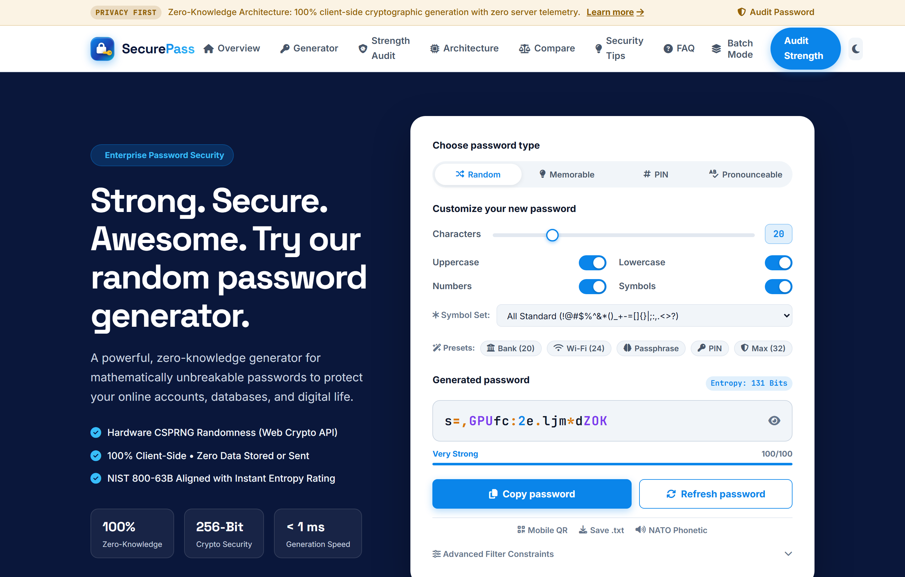

<div align="center">

<p>⭐ <strong>If you like this project, please star the repository!</strong> ⭐</p>
<hr>

# 🔐 SecurePass — Cryptographic Password Generator & Security Suite

<p align="center">
  <strong>A high-entropy, zero-knowledge password generator and cybersecurity audit suite inspired by 1Password enterprise design.</strong>
</p>

<p align="center">
  <a href="https://github.com/kumaran247/Password-Generator">
    
  </a>
  <a href="https://github.com/kumaran247/Password-Generator/fork">
    
  </a>
  <a href="https://github.com/kumaran247/Password-Generator/blob/main/LICENSE">
    
  </a>
</p>

<p align="center">
  
  
  
  
  
</p>

<p align="center">
  <a href="#-overview">Overview</a> •
  <a href="#-features">Features</a> •
  <a href="#-tech-stack">Tech Stack</a> •
  <a href="#-getting-started">Getting Started</a> •
  <a href="#-usage--keyboard-shortcuts">Usage</a> •
  <a href="#-screenshots">Screenshots</a> •
  <a href="#-license">License</a>
</p>

</div>

---

## 💡 Overview

**SecurePass** is a client-side cryptographic password generator and deep cybersecurity audit toolkit built with native browser hardware entropy via the **W3C Web Cryptography API** (`crypto.getRandomValues`).

Engineered with strict **zero-knowledge architecture**, SecurePass guarantees that every password calculation, entropy estimation, and pattern penalty evaluation executes 100% locally within your browser sandbox. No passwords, credentials, or telemetry metrics ever touch external servers.

---

## ✨ Features

### 🔀 Multi-Mode Cryptographic Generation
- **Random Complex**: 8 to 64 character alphanumeric & symbol combinations with customizable symbol sets.
- **Memorable Passphrase (Diceware/xkcd)**: 3 to 8 words curated from a 600+ word offline dictionary with customizable word separators (`-`, `_`, `.`, space) and optional numbers.
- **Numeric PIN Generator**: 4 to 16 digit PINs with duplicate and sequence elimination.
- **Pronounceable Mode**: Phonetically structured syllables for easy vocalization.

### 🛡️ Real-Time Strength & Entropy Audit
- **SVG Circular Progress Gauge**: Dynamic 0–100 numerical strength score.
- **Multi-Vector Brute-Force Matrix**: Real-time crack time calculations across:
  - *Online Throttled (100 guesses/sec)*
  - *High-End GPU Cluster (10 Billion guesses/sec)*
  - *Supercomputer / Botnet (100 Trillion guesses/sec)*
  - *Memory-Hard / Quantum (Argon2id metric)*
- **14-Point Validation Checklist**: Evaluates length, character sets, Shannon entropy, repeated triples, sequential runs, keyboard walks, and common breach dictionary leaks.
- **Actionable Remediation**: Context-aware security recommendations.

### ⚡ Fast Presets & Productivity Tools
- **1-Click Presets**: Banking (20 chars), Wi-Fi WPA3 (24 chars), 4-Word Passphrase, 6-Digit PIN, Maximum Security (32 chars).
- **Offline Mobile QR Sync**: HTML5 Canvas QR code generated locally with zero network requests for instant scanning to mobile password vaults.
- **Batch Generator**: Bulk generate 5 to 50 passwords with 1-click **.TXT** and **.CSV** export.
- **NATO Phonetic Assistant**: Spells out password characters for phone and verbal verification.
- **Session Password Vault**: History ledger stored in `sessionStorage` with 1-click reload, copy, delete, and purge.

---

## 👩‍💻 Tech Stack

| Technology | Purpose |
| :--- | :--- |
| **HTML5 (Semantic)** | Accessible, standards-compliant DOM structure and canvas rendering |
| **Modern CSS3** | Custom properties (CSS variables), Flexbox, CSS Grid, animations, and dark/light theming |
| **JavaScript (ES6+)** | Zero-dependency cryptographic algorithms, UI state management, and audit engine |
| **Web Crypto API** | `crypto.getRandomValues()` hardware entropy source |
| **Font Awesome 6** | Comprehensive iconography |
| **Google Fonts** | `Space Grotesk`, `Inter`, and `JetBrains Mono` typography |

---

## 📖 Sources, Standards & Math

- **NIST SP 800-63B**: Aligned with NIST Digital Identity Guidelines prioritizing length, character set diversity, and dictionary leak resistance.
- **Shannon Entropy Formula**:
  $$\text{Entropy } (H) = L \times \log_2(N)$$
  *Where $L$ is the password length and $N$ is the character pool cardinality.*
- **W3C Web Cryptography API**: Cryptographically secure pseudorandom number generation (CSPRNG).

---

## 📦 Getting Started

To run SecurePass locally on your computer:

### 🚀 Prerequisites
- Any modern web browser (Google Chrome, Mozilla Firefox, Microsoft Edge, Safari, Brave, Opera).
- Optional: [Node.js](https://nodejs.org/) or Python if you want to use a local development server.

### 🛠️ Installation & Running Locally

1. **Clone the repository:**
   ```bash
   git clone https://github.com/kumaran247/Password-Generator.git
   cd Password-Generator
   ```

2. **Run locally:**
   - **Directly in Browser**: Double-click `index.html` or open it with any web browser.
   - **Using Python Server**:
     ```bash
     python -m http.server 8000
     ```
     *Open `http://localhost:8000` in your browser.*
   - **Using Node.js (`npx serve`)**:
     ```bash
     npx serve .
     ```
   - **Using VS Code Live Server**: Right-click `index.html` and select **"Open with Live Server"**.

---

## 📖 Usage & Keyboard Shortcuts

- **Generate Password**: Click the **"Refresh password"** button or press <kbd>Space</kbd>.
- **Copy Password**: Click the **"Copy password"** button, the password display box, or press <kbd>C</kbd>.
- **Audit Existing Password**: Scroll to the **Strength Audit** section and enter any password in the analyzer input.
- **Batch Generation**: Click **"Batch Mode"** in the top navigation or press <kbd>B</kbd>.
- **Mobile QR Sync**: Click **"Mobile QR"** or press <kbd>Q</kbd> to generate an offline QR code.

---

## 📸 Screenshots

<div align="center">
  <h3>✨ Live Embedded Password Generator</h3>
  

  <h3>🛡️ Real-Time Password Strength & Entropy Audit</h3>
  
</div>

---

## 📄 License

This project is licensed under the **MIT License** — see the [LICENSE](LICENSE) file for details.

---
## 👤 Author

Kumaran R T

GitHub: https://github.com/kumaran247

Linked In: https://www.linkedin.com/in/kumaran24/

